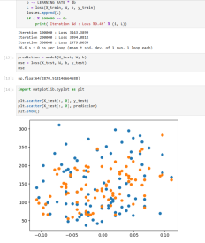
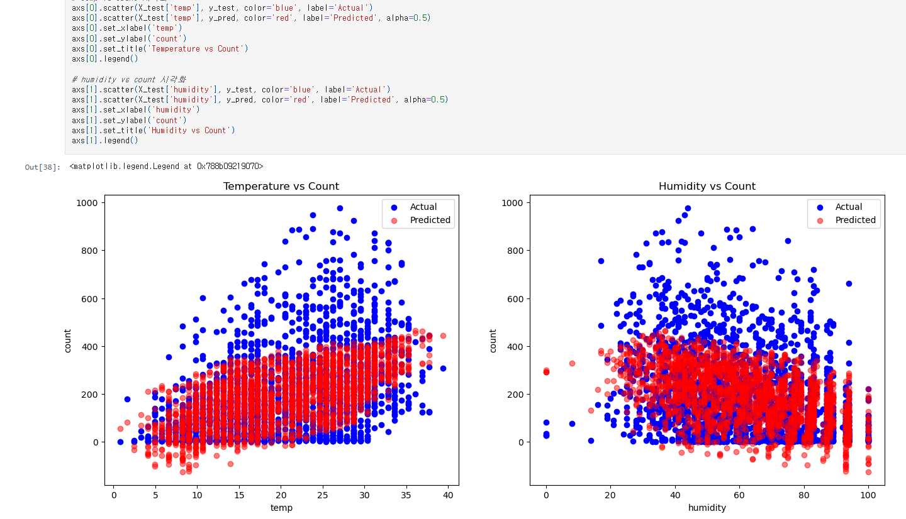

# AIFFEL Campus Online Code Peer Review Templete
- 코더 : 김민
- 리뷰어 : 조연우

# PRT(Peer Review Template)
- [x]  **1. 주어진 문제를 해결하는 완성된 코드가 제출되었나요?**

     

1.클래스 구분은 가능하지만 일부 영역에서 데이터가 겹치며, 추가 성능 지표가 없어 정확한 평가에는 한계가 있다.

2.전체적인 추세는 잘 반영했지만 높은 대여량 구간의 예측력이 다소 부족한 모습이다.
    
- [ ]  **2. 전체 코드에서 가장 핵심적이거나 가장 복잡하고 이해하기 어려운 부분에 작성된 
주석 또는 doc string을 보고 해당 코드가 잘 이해되었나요?**

:주석 없음
- [ ]  **3. 에러가 난 부분을 디버깅하여 문제를 해결한 기록을 남겼거나
새로운 시도 또는 추가 실험을 수행해봤나요?**

:없음
- [ ]  **4. 회고를 잘 작성했나요?**

 :없음
- [ ]  **5. 코드가 간결하고 효율적인가요?**

:간결하고 효율적이에요

# 회고(참고 링크 및 코드 개선)

:모델이 정상적으로 학습되는 과정을 확인할 수 있었으며, 시각화를 통해 결과를 직관적으로 확인할 수 있었습니다. Loss 감소와 RMSE 결과를 통해 전반적인 성능은 양호한 것으로 보이며, 추가적인 평가 지표와 결과 분석이 보강된다면 더욱 완성도 높은 프로젝트가 될 것 같습니다.