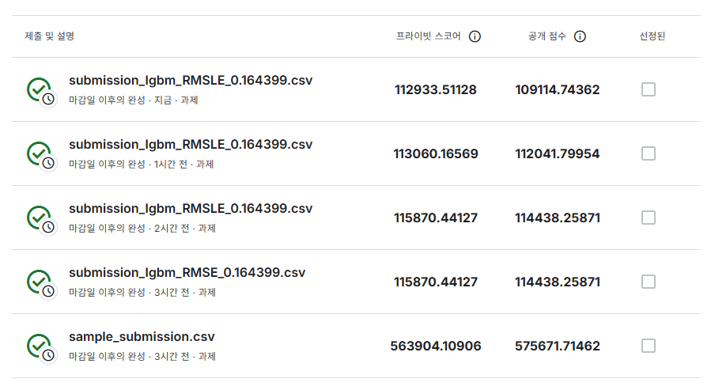
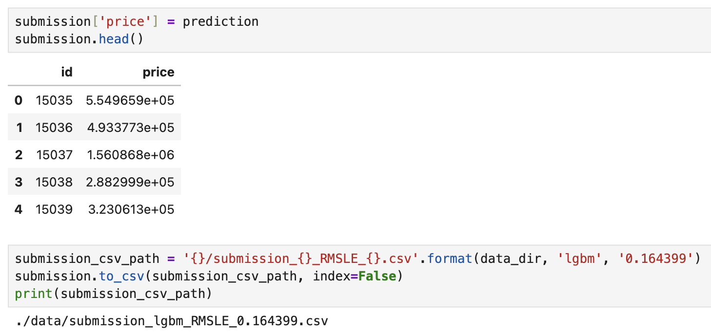
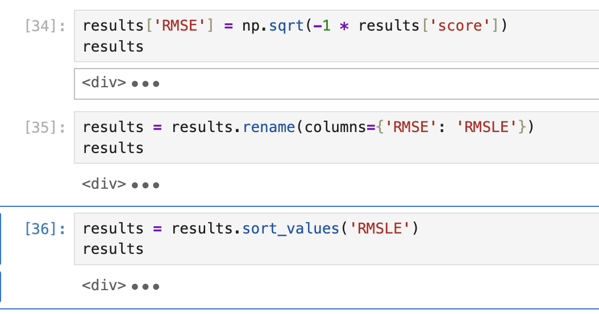
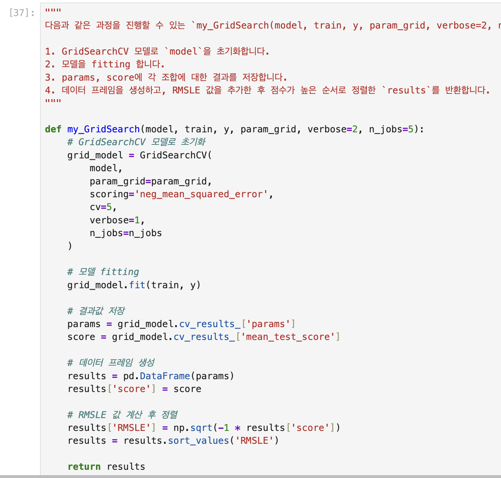
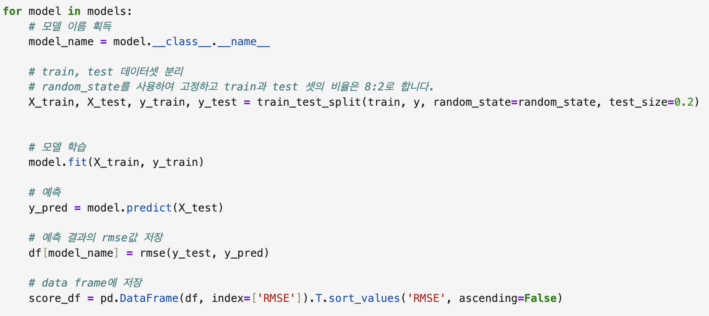
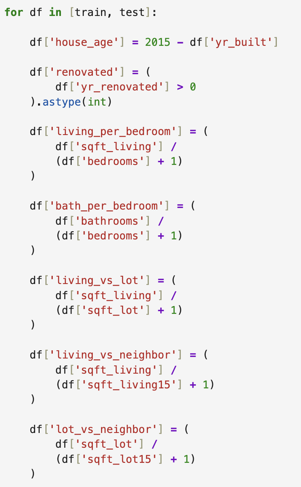
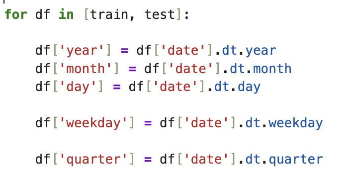

# AIFFEL Campus Online Code Peer Review Templete
- 코더 : 김민
- 리뷰어 : 이다겸


# PRT(Peer Review Template)
- [ ]  **1. 주어진 문제를 해결하는 완성된 코드가 제출되었나요?**

[평가기준]  

1. 다양한 피처 엔지니어링과 하이퍼 파라미터 튜닝 등의 최적화 기법을 통해 캐글 리더보드의 Private score 기준 110000 이하의 점수를 얻었다.  


```text
최종 제출 기준 private score가 11만점 이상으로, 평가 기준을 만족하기 못하였다.  
```

2. 제출한 주피터노트북 파일이 캐글 커널 환경에서도 에러 없이 동작하며, 전처리, 학습, 최적화 진행 과정이 체계적으로 기술되었다.  


```
에러없이 작동하하였다. 다만 중복되는 코드들이 다수 있어서 정리가 필요하다고 판단된다.
```



3. 작성한 노트북을 캐글에 제출했다.  
```
정상적으로 제출이 완료되었음을 확인하였다.  
```
    
- [x]  **2. 전체 코드에서 가장 핵심적이거나 가장 복잡하고 이해하기 어려운 부분에 작성된 
주석 또는 doc string을 보고 해당 코드가 잘 이해되었나요?**



```text
모델 학습을 함수로 정의한 부분은 이번 과제에서 가장 핵심적인 부분이다. 
각 코드별로 주석을 달아 어떤 작동을 하는 코드인지 명시하였다. 
다만 아래와 같이 파생변수를 추가하는데에 따른 주석이 누락되어 있어 보완이 필요하다 
```

        
- [ ]  **3. 에러가 난 부분을 디버깅하여 문제를 해결한 기록을 남겼거나
새로운 시도 또는 추가 실험을 수행해봤나요?**
```text
코드 상에서 확인되는 디버깅 기록, 또는 추가 실험 기록은 없다. 
```
        
- [ ]  **4. 회고를 잘 작성했나요?**
```text
파일 내에서 확인되는 회고는 없다.  
```
        
- [x]  **5. 코드가 간결하고 효율적인가요?**


```text
트레이닝 데이터와 테스트 데이터의 date 컬럼을 판다스를 이용하여 datetime64타입으로 바꾸고, 이를 이용해서 date 값을 연월일, 요일, 분기로 구분하기 위해서 반복문을 사용한 것은 간결하면서도 효율적인 선택이라 생각한다. 
```


# 회고(참고 링크 및 코드 개선)
```
이번 과제는 데이터 파악, 전처리, 그리고 모델 학습을 이용한 분석을 완성하고 캐글에 제출하여 목표 점수에 도달하는 과제인 만큼, 생각해보아야 할 것도 많고 모델 최적화에 시간도 많이 걸렸을 것이다. 
코더의 코드들을 보았을 때 그러한 과정을 잘 이행하였으며, 더 발전시킨다면 충분히 11만점 이하로 private score를 낮출 수 있을거라 생각한다. 
퀘스트에서 준 힌트처럼, 하이퍼파리미터값을 조정하거나, 모델 블렌딩 기법을 이용해서 실험해본다면 좋은 결과로 이어질 것이다. 
또한 노드 학습에서 연습한 코드들을 잘 이용하였다. 다만 중복되는 코드들이 다수 존재하는 바 이를 교정한다면 더 밀도있고 완성도 높은 코드를 구성할 수 있을 것이다.
```
