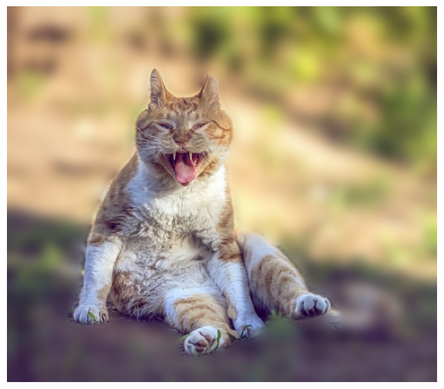
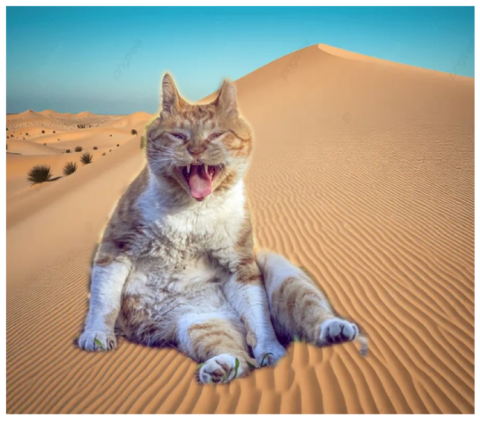
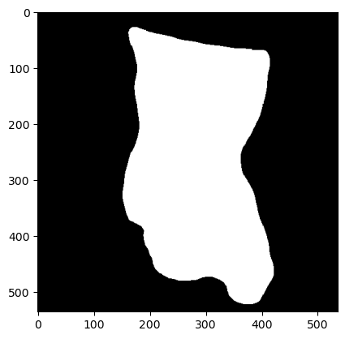
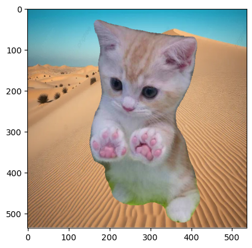

# AIFFEL Campus Online Code Peer Review Templete
- 코더 : 김민
- 리뷰어 : 김민욱


# PRT(Peer Review Template)
- [x]  **1. 주어진 문제를 해결하는 완성된 코드가 제출되었나요?**
    - 고양이 누끼 따서 배경 합성하는 세그멘테이션 문제를, DeepLabV3와 YOLO11-seg 두 가지로 끝까지 완성하셨네요.  
    - 아웃포커싱(배경 블러)과 사막 배경 크로마키까지 결과물이 다 나와 있어서 좋았습니다.  
    - 아웃포커싱 결과  
    

    - 사막 배경 크로마키 결과  
    

- [x]  **2. 전체 코드에서 가장 핵심적이거나 가장 복잡하고 이해하기 어려운 부분에 작성된 주석 또는 doc string을 보고 해당 코드가 잘 이해되었나요?**
    - 제일 핵심은 YOLO 마스크를 만들고 그걸로 원본과 블러 배경을 섞는 부분(아웃포커싱 셀)이라고 봤어요.  
    - `mask_f` 를 0~1 사이 실수로 바꿔서 `원본 * mask_f + 블러 * (1 - mask_f)` 로 합성하는 게 한 번에 이해가 안 됐는데, 줄마다 한글 주석이 달려 있어서 "아 고양이 자리는 원본, 나머지는 블러구나" 하고 따라갈 수 있었습니다.  
    - 특히 BGR↔RGB 변환을 왜 자꾸 하는지 주석으로 짚어주신 게 좋았어요. OpenCV로 저장할 때 다시 BGR로 돌리는 것까지 적어두셔서 헷갈리지 않았습니다.  
    - 마스크가 실제로 어떻게 잡혔는지도 중간에 출력해두셔서 이해에 도움이 됐습니다.  
       
    
    ```python  
    # 마스크 경계선 GaussianBlur로 그라데이션
    mask = cv2.GaussianBlur(mask, (21, 21), 0)  
    # mask_f 는 고양이만 딱 가져와서 합성 재료로 만듦  
    mask_f = mask.astype(np.float32) / 255.0   
    mask_f = np.dstack([mask_f] * 3)    
    # 배경 전체를 흐리게  
    blurred = cv2.GaussianBlur(img_rgb, (51, 51), 0)  
    # mask_f 고양이 + 블러 배경  
    out = (img_rgb * mask_f + blurred * (1.0 - mask_f)).astype(np.uint8)  
    ```  

- [x]  **3. 에러가 난 부분을 디버깅하여 문제를 해결한 기록을 남겼거나 새로운 시도 또는 추가 실험을 수행해봤나요?**
    - 이 부분이 제일 인상적이었어요. 첫 합성에서 누끼가 거칠게 따여서 다리 주변이 깔끔하지 않은 걸 직접 캡처해서 "발이 짤렸다"고 솔직하게 기록하셨더라고요.  
    

    - 거기서 멈추지 않고 "밝아서 세그가 잘 안 된 것 같다 -> 더 진한 사진으로 교체" 하는 식으로 원인을 추측하고 사진을 바꿔 재시도하신 흐름이 좋았습니다.  
    - 그래도 안 되니까 아예 DeepLabV3에서 YOLO11-seg 모델로 갈아타신 것, 그리고 rembg + opencv 후처리 같은 방법을 추가로 조사해 적어두신 것도 추가 실험으로 잘 남기셨네요.  

- [x]  **4. 회고를 잘 작성했나요?**
    - 맨 끝에 "세그멘테이션이 까다롭다, 누끼가 원하는 대로 안 따지고 발이 잘리고 배경이 섞여 들어온다, 더 정밀한 방법을 공부해야겠다" 하고 배운 점과 아쉬운 점을 솔직하게 적어주셨어요.  
    - 중간중간 "다리 사이 풀은 어떻게 하지?" 처럼 막힌 지점을 그때그때 메모해두신 것도 회고로 읽혀서 좋았습니다.  
    - 한 가지, 전체 실행 플로우(이미지 로드 -> 세그 -> 마스크 -> 합성)를 그림이나 그래프로 한 번 정리해주시면 흐름이 더 잘 보일 것 같아요.  

- [x]  **5. 코드가 간결하고 효율적인가요?**
    - 변수명이 직관적이고(`cat_img`, `mask_f`, `blurred`) 주석도 충분해서 읽기 편했습니다.  
    - `np.unique` 로 예측된 클래스 ID를 먼저 확인하고 `unique_classes[-1]` 로 고양이 클래스를 잡으신 게 좋았어요. 클래스 번호(8)를 그냥 박아두지 않고 동적으로 고르신 거라, 사진이 바뀌어도 잘 동작할 것 같습니다.  
    - YOLO 호출에 `verbose=False` 를 줘서 불필요한 출력을 정리하신 것, 결과를 `cv2.imwrite` 로 파일로 저장해 나중에 다시 볼 수 있게 하신 것도 깔끔했습니다.  
    - `result.masks is not None` 으로 마스크가 없을 때를 한 번 걸러주신 것도, 에러 안 나게 신경 쓰신 게 보여서 좋았습니다.  


# 회고(참고 링크 및 코드 개선)
```
[리뷰어 회고]
나도 같은 노드를 하면서 누끼가 깔끔하게 안 따져서 아쉬웠는데,
김민님이 DeepLab 으로 안 되니까 YOLO-seg 로 모델을 통째로 바꿔보신 게
제일 인상적이었습니다. "모델 자체를 바꾸는 것도 한 방법이구나" 하고 배웠어요.
GaussianBlur 로 마스크 경계를 부드럽게 한 아이디어도 가져가고 싶고,
예측 클래스를 np.unique 로 확인해서 동적으로 고르신 것도 깔끔했습니다.
중간중간 적어두신 솔직한 감상 주석들("왜 이렇게 귀찮게", "알지?")도
읽는 재미가 있으면서, 본인이 코드를 이해하고 넘어간 흔적 같아서 좋았어요.
고생 많으셨습니다!

[참고 링크]
- rembg: https://github.com/danielgatis/rembg
  김민님이 두 번째 합성(사막 배경, cat_grass.png) 결과 바로 아래
  "다리 사이 풀은 어떻게 하지?"로 시작하는 마크다운 셀에서
  "AI한테 물어보니 rembg로 누끼 따고 opencv로 마스크 찌꺼기 제거" 라고
  적어두셨더라고요. rembg는 딥러닝으로 배경을 떼주는(누끼) 도구인데,
  README "Usage as a CLI" 의 "Apply alpha matting"(rembg i -a 입력 출력,
  즉 -a 플래그)을 켜면 거친 경계를 부드럽게 다듬어 준다고 합니다.
  거기가 "경계가 깔끔해진다"의 근거 같아요. (-om 플래그로 마스크만 따로
  뽑을 수도 있어서, opencv 후처리랑 같이 쓰기 좋아 보였습니다.)
```
