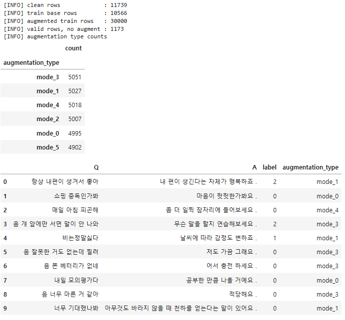
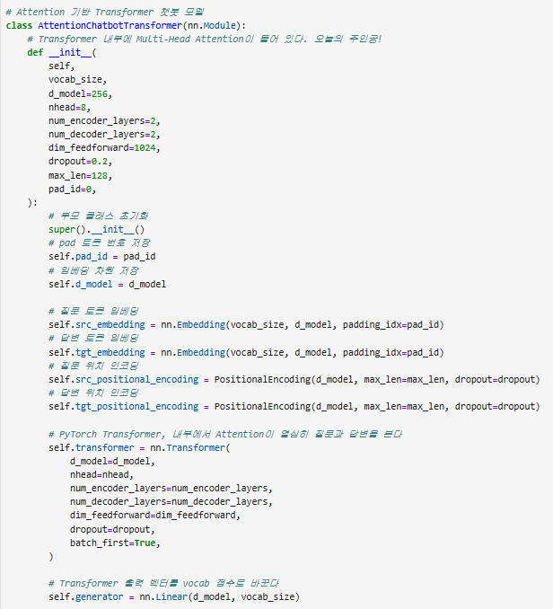
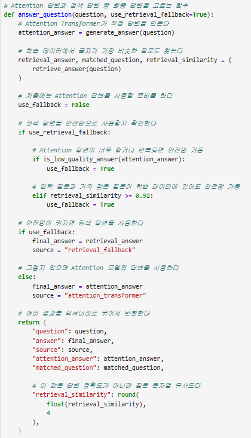
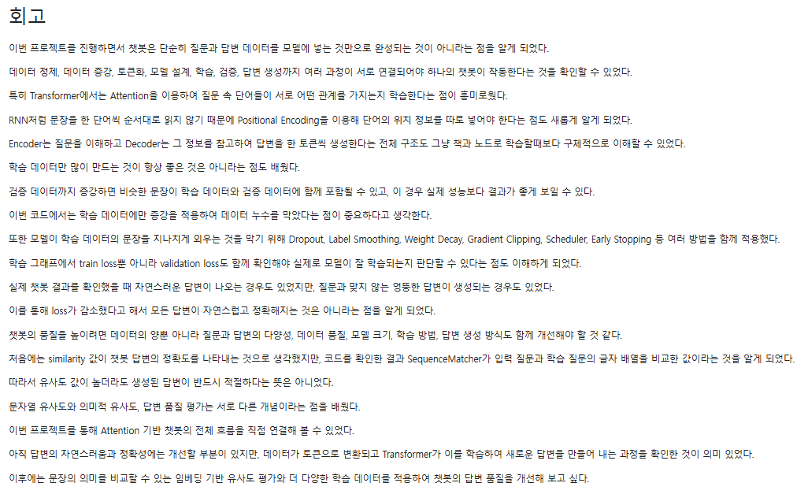
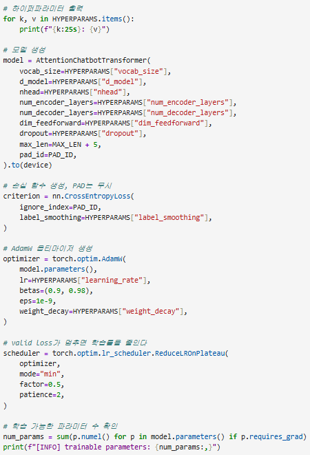

# AIFFEL Campus Online Code Peer Review Templete

* 코더 : 김민
* 리뷰어 : 천세문

# PRT(Peer Review Template)

* [x] **1. 주어진 문제를 해결하는 완성된 코드가 제출되었나요?**
* 문제에서 요구하는 최종 결과물이 첨부되었는지 확인
* **[결과 구체화]** 챗봇 데이터 전처리와 데이터 증강이 정상적으로 수행되어 `augmented train rows : 30000`개의 목표치를 정확히 달성했습니다.
* 트랜스포머 모델 학습 완료 후, `chat()` 함수를 이용해 10개의 예시 질문("트랜스포머 모델 학습이 너무 어렵다", "아이펠 수업에 대해 어떻게 생각해?" 등)에 대한 답변을 생성했으며, 이를 `sample_answer_df` 데이터프레임을 통해 `answer`, `source`, `retrieval_similarity` 등과 함께 깔끔한 표 형태로 출력했습니다.

<details>
<summary>📸 근거 사진 보기 (클릭)</summary>

<p align="center">
  
</p>

</details>


* [x] **2. 전체 코드에서 가장 핵심적이거나 가장 복잡하고 이해하기 어려운 부분에 작성된 주석 또는 doc string을 보고 해당 코드가 잘 이해되었나요?**
* **[결과 구체화]** 데이터 증강을 수행하는 `augment_question()` 함수에 `mode 0~5`까지(물음표 추가, '음' 등 시작어 추가, 동의어 교체 등) 각각의 동작 방식이 한글 주석으로 아주 명확하게 설명되어 있습니다.
* 가장 핵심이 되는 `AttentionChatbotTransformer` 클래스의 `forward` 메서드 내부에서 `src_key_padding_mask`와 `make_tgt_subsequent_mask`가 어떤 역할을 하는지(예: "답변이 미래 토큰을 보지 못하게 하는 마스크") 상세히 기록되어 있어 트랜스포머의 구조적 이해가 매우 쉬웠습니다.

<details>
<summary>📸 근거 사진 보기 (클릭)</summary>

<p align="center">
  
</p>

</details>

* [x] **3. 에러가 난 부분을 디버깅하여 문제를 해결한 기록을 남겼거나 새로운 시도 또는 추가 실험을 수행해봤나요?**
* **[결과 구체화]** 한국어 CSV 파일 로드 시 발생할 수 있는 인코딩 에러를 방지하기 위해 `utf-8-sig`, `utf-8`, `cp949`를 순차적으로 시도하는 `read_csv_safely()` 함수를 구현하여 코드 안정성을 크게 높였습니다.
* **[추가 실험]** 단순 생성 모델의 한계를 극복하기 위해 **하이브리드 챗봇(Generative + Retrieval)** 형태를 구현한 점이 매우 훌륭합니다. `is_low_quality_answer()` 함수를 만들어 생성된 답변의 길이가 2자 미만이거나 흔한 토큰 비율이 35% 이상일 경우, `SequenceMatcher`를 이용한 검색 기반 답변(Fallback)으로 우회하도록 설계한 아이디어는 실무적으로도 훌륭한 접근입니다.

<details>
<summary>📸 근거 사진 보기 (클릭)</summary>

<p align="center">
  
</p>

</details>

* [x] **4. 회고를 잘 작성했나요?**
* **[결과 구체화]** 회고를 통해 프로젝트의 핵심 인사이트를 아주 잘 짚어내셨습니다.
* 특히, "학습 데이터에만 증강을 적용하여 검증 데이터의 누수(Data Leakage)를 막은 점"과 "SequenceMatcher가 의미적 유사도가 아닌 문자열 유사도를 비교한다는 한계점"을 스스로 깨닫고 기록하신 부분이 인상 깊습니다.
* 또한 과적합 방지를 위해 적용한 다양한 기법들(Label Smoothing, Weight Decay, Gradient Clipping)의 효과와 한계를 분석적으로 잘 작성해주셨습니다.

<details>
<summary>📸 근거 사진 보기 (클릭)</summary>

<p align="center">
  
</p>

</details>

* [x] **5. 코드가 간결하고 효율적인가요?**
* **[결과 구체화]** 코드의 모듈화와 파라미터 관리가 매우 깔끔합니다.
* 하이퍼파라미터들을 하드코딩하지 않고 `HYPERPARAMS`라는 딕셔너리로 한곳에 모아 관리하여 실험 조건 변경이 매우 편리하게 설계되었습니다.
* `seed_everything()` 함수로 재현성을 보장하고, `install_if_missing()` 함수로 실행 환경(패키지)의 종속성 문제까지 자동으로 해결하도록 구성한 점이 매우 효율적입니다.

<details>
<summary>📸 근거 사진 보기 (클릭)</summary>

<p align="center">
  
</p>

</details>


# 회고(참고 링크 및 코드 개선)

```
# 리뷰어의 회고를 작성합니다.
김민 님의 코드를 리뷰하면서 NLP 프로젝트를 구성하는 정석적인 구조와 엔지니어링 팁들을 많이 배울 수 있었습니다.
특히, 데이터 증강 시 검증(Validation) 데이터셋은 원본을 유지하여 평가 지표의 신뢰성을 확보한 점, 
그리고 트랜스포머 모델이 문장을 반복 생성하는 고질적인 문제를 해결하기 위해 `apply_repetition_penalty`와 `block_repeated_ngram` 함수를 직접 세밀하게 통제한 점이 매우 인상 깊었습니다.
또한, 모델이 생성한 답변의 품질이 낮을 때를 대비해 검색 기반(SequenceMatcher)의 Fallback 기능을 결합한 '하이브리드 챗봇' 아키텍처는 프로젝트의 완성도를 한 단계 끌어올린 최고의 시도였다고 생각합니다. 완성도 높은 코드 감사합니다!

```