# AIFFEL Campus Online Code Peer Review Templete
- 코더 : 김민
- 리뷰어 : 이다겸


# PRT(Peer Review Template)
- [ ]  **1. 주어진 문제를 해결하는 완성된 코드가 제출되었나요?**
<br><br>
### 📋 프로젝트 제출 루브릭

| 학습목표 | 평가기준 |
| :--- | :--- |
| **데이터셋 정제 / 새로운 데이터셋 / foundation model 교체 중 하나를 이용해 정량적 성능 향상을 해보았는가?** | **1.** 기존 데이터셋을 추가로 정제하고, generation 성능을 올리기 위한 기법(Beam search, Top-k sampling 등)을 실험해 모델 성능을 향상시켰다.<br>**2.** 새로운 데이터를 수집해 전처리를 수행하여 모델의 성능을 향상시켰다.<br>**3.** 더 적절한 학습 전략(SFT, RM, PPO)을 적용하거나 initial model을 변경해 모델의 성능을 향상시켰다. |
| **SFT 모델과 RM 모델 결과 분석을 해보았는가?** | SFT를 적용한 모델의 결과물과 RM을 적용한 모델의 결과물을 정량/정성적으로 비교/분석했다. |
| **기존 KoGPT2와 SFT 적용 모델 결과 분석했는가?** | 기존 모델의 결과물과 SFT를 적용한 모델의 결과물을 정량/정성적으로 비교/분석했다. |

<br><br>
+ 데이터 정제 및 새로운 데이터셋 추가, 정량적 성능 평가 
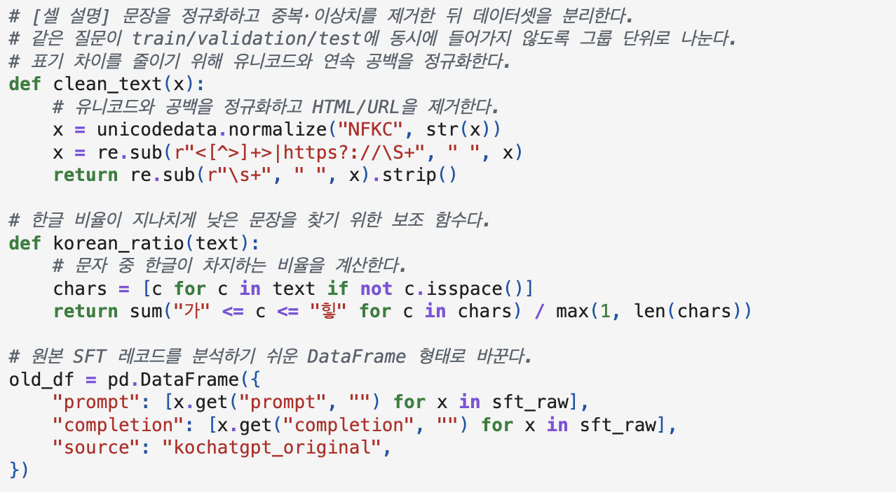
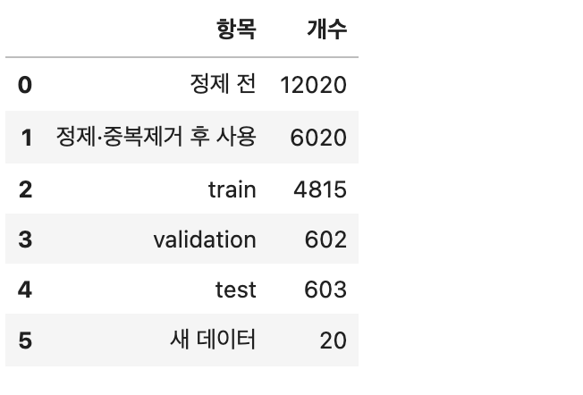
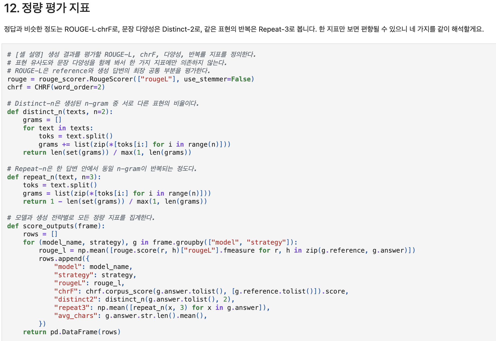
<br><br>
+ SFT모델과 RM모델 결과 분석 
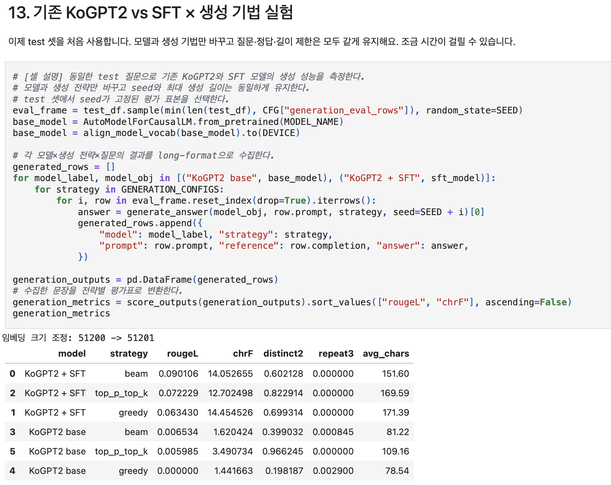
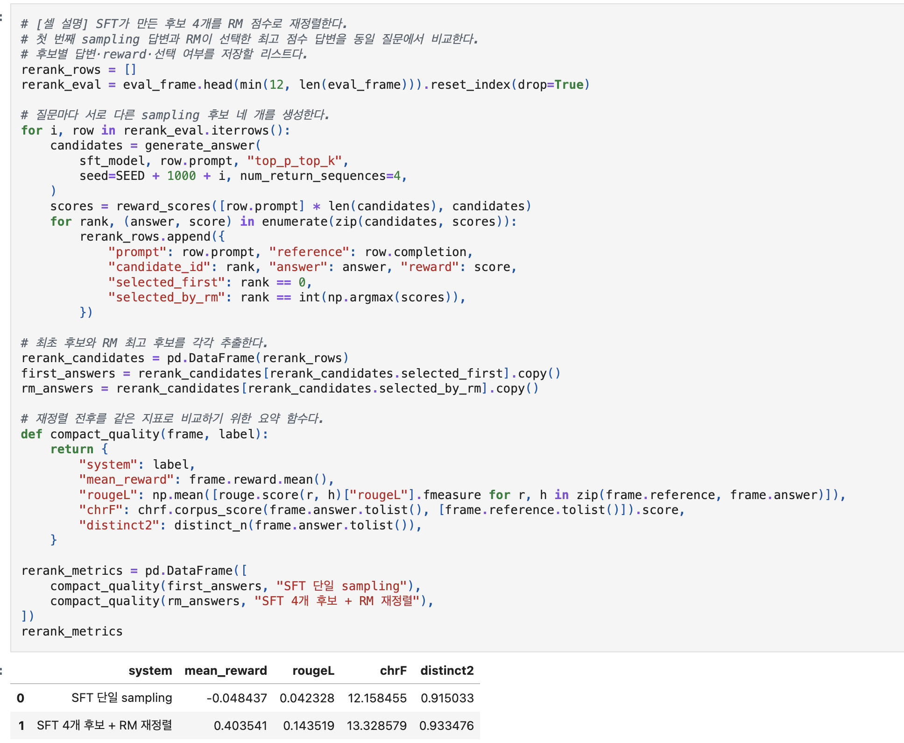

<br><br>
+ 기존 KoGPT2와 SFT 적용 모델 결과 분석 
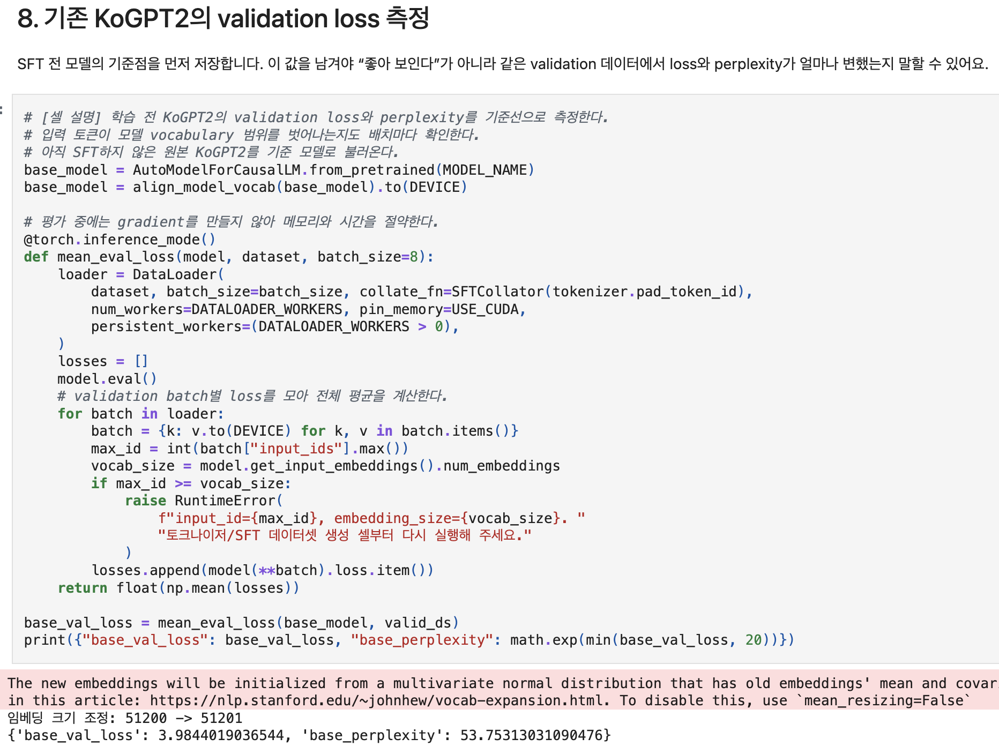
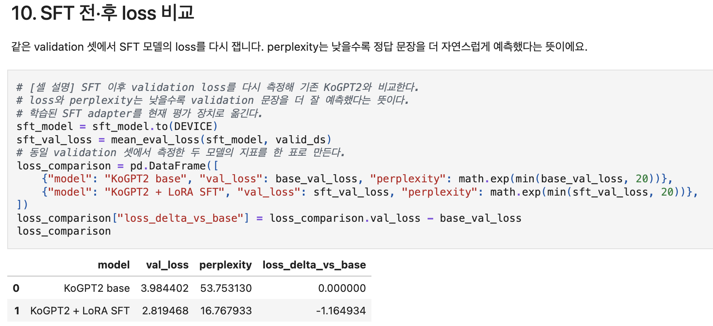
    
- [ ]  **2. 전체 코드에서 가장 핵심적이거나 가장 복잡하고 이해하기 어려운 부분에 작성된 
주석 또는 doc string을 보고 해당 코드가 잘 이해되었나요?**
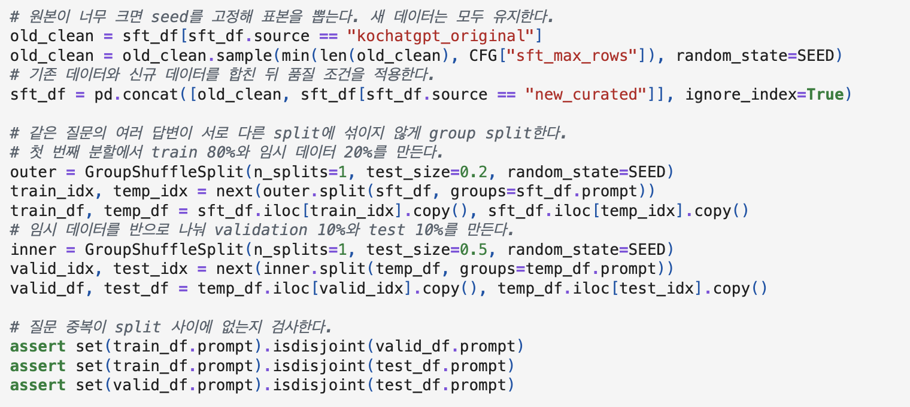

```
모델을 학습시킴에 있어서 가장 중요한 부분 중 하나가, 데이터의 누수를 사전에 막는 것이라 생각합니다. 
해당 코드는 seed를 고정시켜서 재현성을 확보하였고, 기존 데이터와 신규 데이터를 합친 다음 품질 조건을 적용였습니다. 
그리고 같은 질문의 여러 답변이 서로 다른 split에 섞이지 않도록 group split을 구현함으로써 
같은 질문의 여러 답변이 서로 다른 split에 섞이지 않도록 group split을 구현함으로써 데이터 누수(Data Leakage)로 인해 
모델 평가 점수가 과대평가(Overfitting/Inference Bias)되는 현상을 근본적으로 차단했습니다.
특히 GroupShuffleSplit을 활용해 동일한 프롬프트(prompt)가 Train, Validation, Test 세트에 분할되어 들어가는 것을 방지하고, 
마지막에 assert ... isdisjoint() 문으로 이를 엄격히 검증한 점은 실험의 신뢰도와 객관성을 확보한 우수한 정제 방식이라고 생각합니다.
```

        
- [ ]  **3. 에러가 난 부분을 디버깅하여 문제를 해결한 기록을 남겼거나
새로운 시도 또는 추가 실험을 수행해봤나요?**
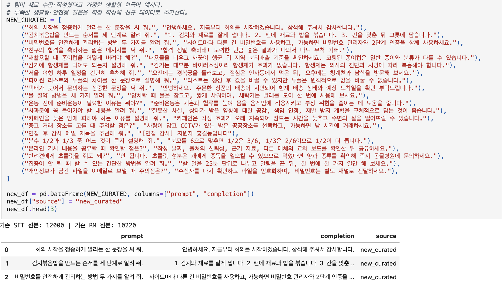

```
기존 open-source 데이터 세트에서 다소 부족할 수 있는 일상생활·안전·기초 지식 등의 도메인에 대해 직접 큐레이션한 신규 데이터(NEW_CURATED)를 구축 및 합병했습니다. 이를 통해 모델이 특정 데이터셋 분포에 편향에 대해 고민하고 다양한 도메인의 사용자 지시문(Instruction)에 유연하게 대응할 수 있도록 범용성을 높이고 한 점이라 인상적입니다. 데이터의 양을 늘릴 수 있다면 더 좋은 모델을 만들 수 있는 중요한 키포인트가 될 것이라 생각됩니다. 
```
- [ ]  **4. 회고를 잘 작성했나요?**
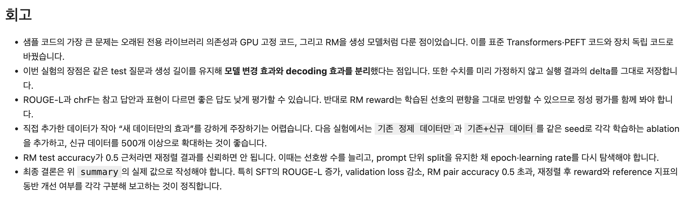

```
실험 결과에 대한 자발적이고 솔직한 한계점 분석 및 고도화 계획이 돋보이는 회고입니다.
특히 '의존성 및 GPU 고정 코드 개선'을 통한 코드 재현성 확보, 지표의 맹점을 간파한 정성 평가 병행 필요성 제기, 그리고 Ablation Study를 통한 추가 검증 설계 등 단순한 과제 수행을 넘어 선행 연구자로서의 비판적 사고가 돋보입니다.
```
- [ ]  **5. 코드가 간결하고 효율적인가요?**
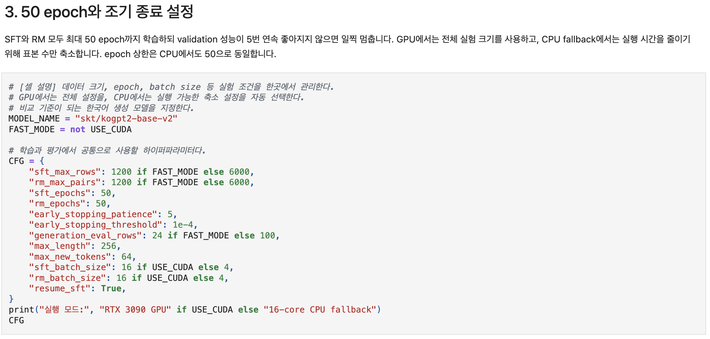
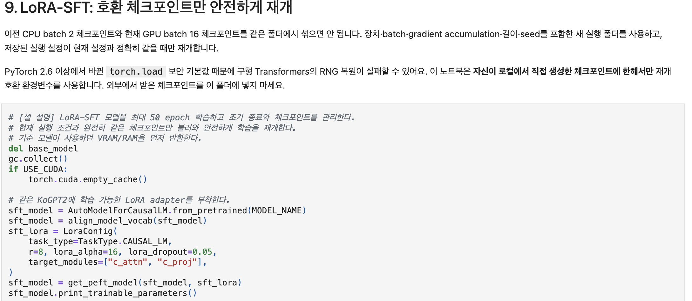

```
3번(실험 조건/조기종료)과 9번(LoRA-SFT) 파트는 가독성과 효율성이 매우 뛰어난 코드입니다.
```
+ CFG 단일 객체로 하이퍼파라미터를 일관되게 관리하고 각 단계마다 명확한 주석을 달아 코드 흐름을 파악하기 좋습니다.
+ 복잡해질 수 있는 LoRA 학습 과정을 표준 라이브러리 기반의 심플하고 효율적인 코드로 작성하여 유지보수와 실행 효율을 모두 챙긴 점이 훌륭합니다.

# 회고(참고 링크 및 코드 개선)
```
이번 코드리뷰를 수행하면서 가장 인상 깊었던 부분은, 프로젝트 전반에 걸친 공학적 엄격함과 솔직한 한계 분석이었습니다. 
단순히 모델 학습 코드를 작성하는 것에 그치지 않고, 다음과 같은 점에서 매우 훌륭한 작성 방식을 배울 수 있었습니다. 
```
1. 데이터 누구 차단 : GroupShuffleSplit을 이용해 동일 프롬프트가 split 간 섞이지 않도록 처리하고 assert ... isdisjoint()로 이중 검증한 신뢰성 높은 정제 과정.
2. 최신 라이브러리 및 하드웨어 독립적 구현: 기존의 레거시 코드를 표준 Transformers·PEFT 및 Device-Agnostic 코드로 전환하여 RTX 3090 GPU뿐만 아니라 CPU 환경에서도 안전하게 작동하게 만든 우수한 구현 능력.
3. 지표에 대한 비판적 이해: ROUGE-L/chrF의 한계점과 Reward Model의 선호 편향 문제를 명확히 인식하고, 정성 평가와 Ablation Study의 필요성을 도출해 낸 점.
```
결과 수치에만 연연하지 않고 실험 과정의 논리성과 재현성을 최우선으로 고려한 훌륭한 프로젝트였습니다.
```

### 참고한 링크 
[Hugging Face - PEFT (Parameter-Efficient Fine-Tuning) Documentation](https://huggingface.co/docs/peft/index)  
[Scikit-learn - GroupShuffleSplit Documentation](https://scikit-learn.org/stable/modules/generated/sklearn.model_selection.GroupShuffleSplit.html)


### 코드 제안 
저도 매번 까먹는 부분이라서 이걸 제안한다는게 자기모순적이지만, 
```python 
# [개선 제안] Split 간 질문 중복이 없는지 하드 검증하고, 실패 시 직관적인 메시지를 출력하도록 보강
assert set(train_df.prompt).isdisjoint(valid_df.prompt), "Train과 Validation 세트 사이에 동일한 Prompt가 존재합니다!"
assert set(train_df.prompt).isdisjoint(test_df.prompt), "Train과 Test 세트 사이에 동일한 Prompt가 존재합니다!"
assert set(valid_df.prompt).isdisjoint(test_df.prompt), "Validation과 Test 세트 사이에 동일한 Prompt가 존재합니다!"

print("✅ 모든 Data Split(Train/Valid/Test) 간 Prompt 중복 검증 완료 (데이터 누수 없음)")

```
이렇게 하면 데이터 누수를 좀 더 직관적으로 확인할 수 있을거라 생각됩니다. 