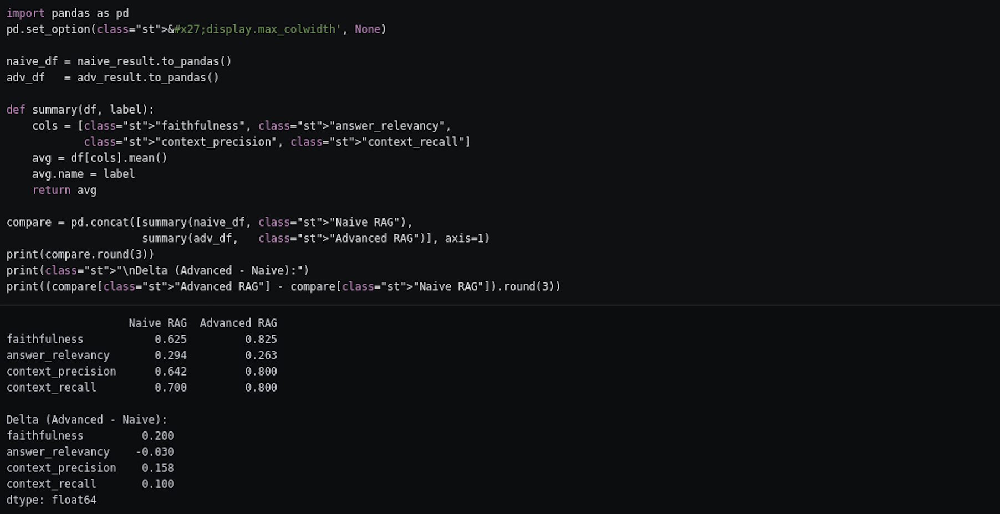
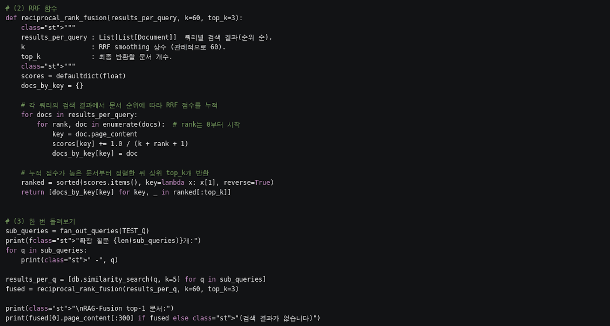
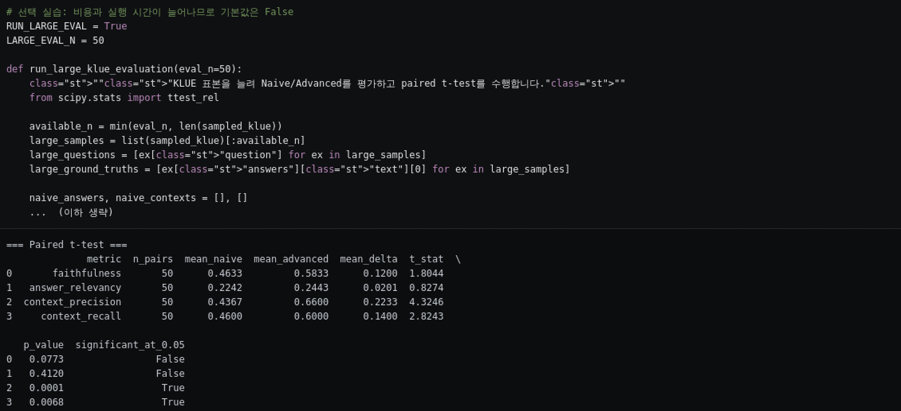
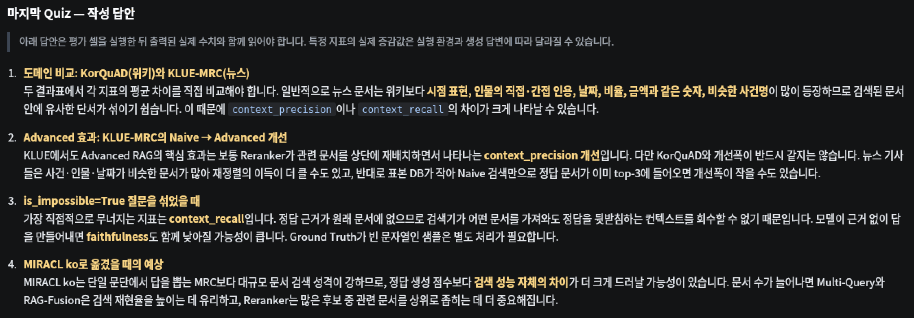
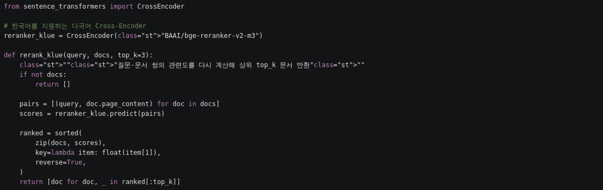

# AIFFEL Campus Online Code Peer Review Templete
- 코더 : 김민
- 리뷰어 : 강경수


# PRT(Peer Review Template)
- [x]  **1. 주어진 문제를 해결하는 완성된 코드가 제출되었나요?**
    - 메인 실습(KorQuAD v1)의 Naive → Multi-Query → RAG-Fusion(RRF) → HyDE → Cross-Encoder Reranking → Self-RAG까지 전 단계가 빠짐없이 구현되어 있고, RAGAS 4대 지표 비교표까지 정상 출력되었습니다.
    - 추가 실습인 KLUE-MRC 도메인 이식도 Step A~K까지 모두 수행하고, 두 도메인의 평균표를 한 화면에 나란히 출력해 비교까지 마무리했습니다.

    

- [x]  **2. 전체 코드에서 가장 핵심적이거나 가장 복잡하고 이해하기 어려운 부분에 작성된 
주석 또는 doc string을 보고 해당 코드가 잘 이해되었나요?**
    - 직접 채워야 했던 `reciprocal_rank_fusion` 함수를 핵심 코드로 봤습니다. RRF는 순위 기반 누적 점수라 처음 보면 헷갈리기 쉬운데, docstring에 세 인자(`results_per_query`, `k`, `top_k`)의 의미를 각각 적어두셔서 바로 이해됐습니다.

    

- [x]  **3. 에러가 난 부분을 디버깅하여 문제를 해결한 기록을 남겼거나
새로운 시도 또는 추가 실험을 수행해봤나요?**
    - 선택 과제인 Step K를 `RUN_LARGE_EVAL = True`로 실제로 돌리셨습니다. 표본을 20 → 50문항으로 늘리고 paired t-test까지 수행해서, 개선이 우연인지 아닌지를 p값으로 확인한 부분이 인상적이었습니다.
    - `significant_at_0.05` 컬럼을 따로 만들어 True/False로 정리해두신 것도 결과를 읽기 편하게 해줬습니다.
    - KLUE 인덱싱에서 토큰 한도에 걸리는 문제도 100개씩 batch로 `add_documents` 호출하고 진행률을 출력하도록 처리하셨습니다.

    

- [x]  **4. 회고를 잘 작성했나요?**
    - 마지막 Quiz 4문항에 모두 답을 작성하셨고, 단순히 결과를 나열한 게 아니라 "왜 그렇게 나오는가"를 데이터 특성과 연결해 설명하신 점이 좋았습니다.
    - 특히 `is_impossible=True` 문항에서 `context_recall`이 가장 먼저 무너지는 이유를 "정답 근거가 원래 문서에 없으므로 검색기가 무엇을 가져와도 회수할 수 없다"고 정리하신 부분이 명쾌했습니다.
    - MIRACL 확장 예상에서도 "문서 수가 늘면 Multi-Query/RAG-Fusion은 재현율에, Reranker는 후보 좁히기에 더 중요해진다"고 기법별로 나눠 예측하셔서, 각 기법의 역할을 제대로 이해하고 계신 게 보였습니다.

    

- [x]  **5. 코드가 간결하고 효율적인가요?**
    - 기능 단위로 함수가 잘 분리되어 있고, 메인 실습 변수와 충돌하지 않도록 `_klue` 접미사를 일관되게 붙이신 점이 좋았습니다. 덕분에 두 도메인 결과를 한 노트북에서 비교할 수 있었습니다.

    


# 회고(참고 링크 및 코드 개선)
```
전체적으로 TODO를 다 채운 것을 넘어 선택 과제까지 수행한 노트북이라 배울 점이 많았습니다.
특히 표본을 50문항으로 늘려 paired t-test를 붙인 부분은 저도 같은 실습을 하면서
"20문항 평균 차이를 개선이라고 불러도 되나" 하고 넘어갔던 지점이라, 보면서 반성했습니다.
고생 많으셨습니다!
```
