- 섹션 1.5 수행내역 캡쳐

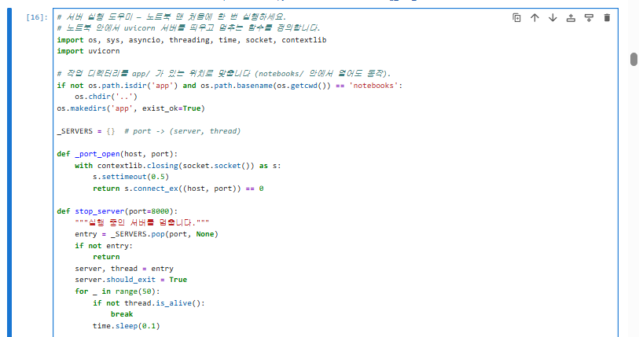  
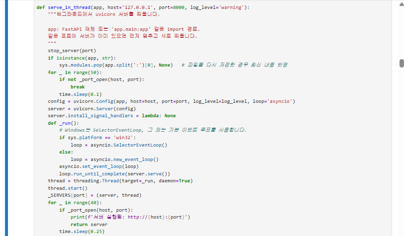  
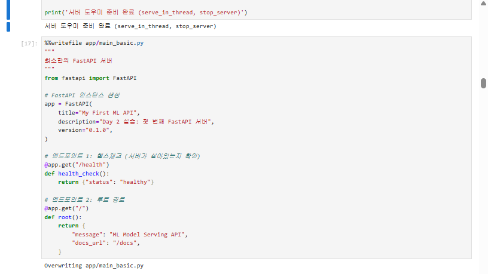  
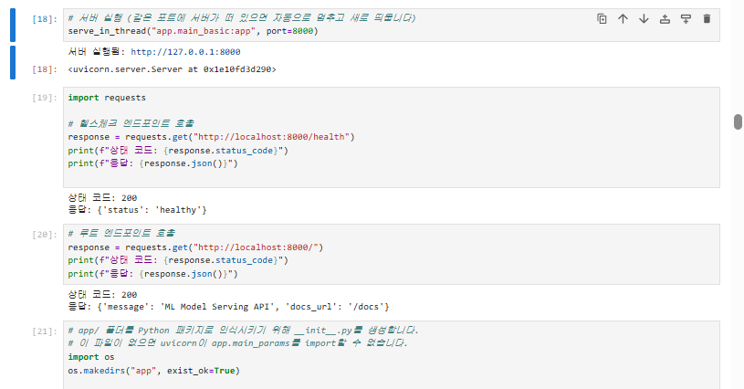  

- 섹션2 셀 출력

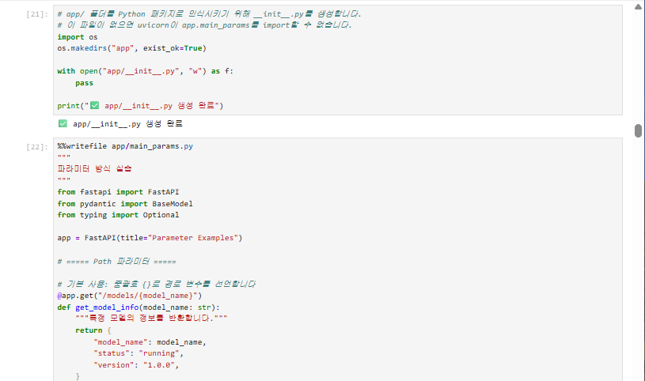  
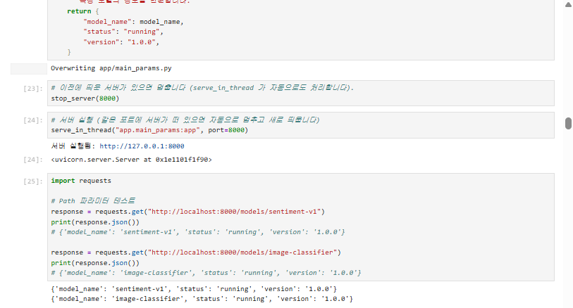  
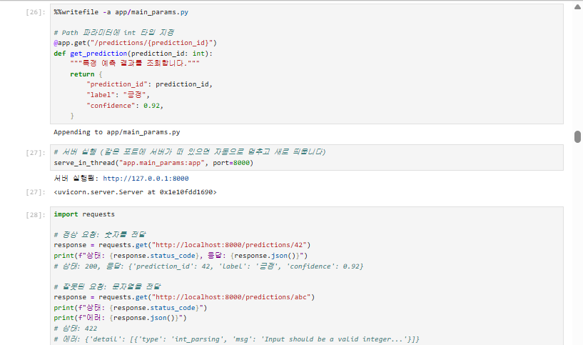  
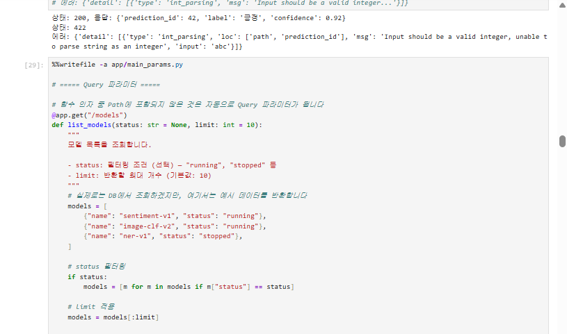  
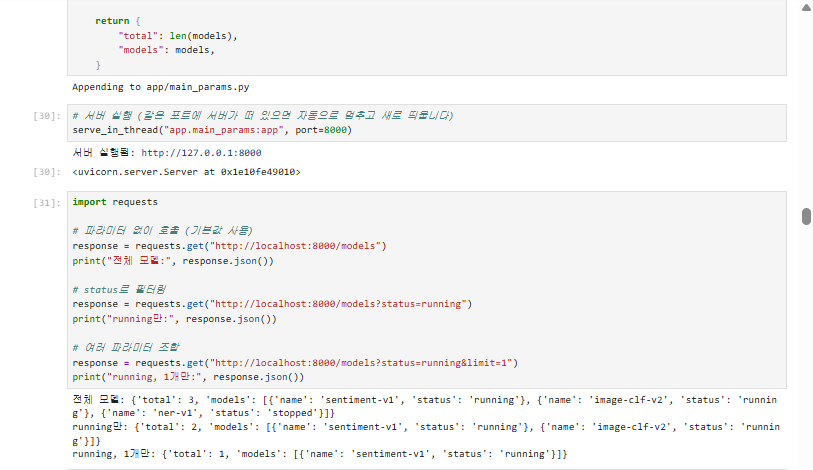  
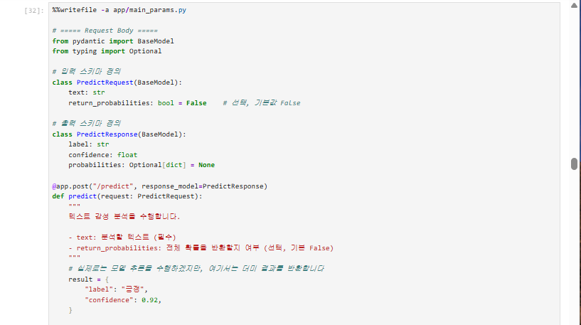  
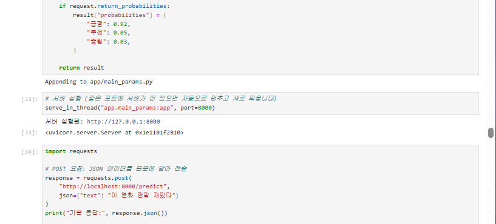  
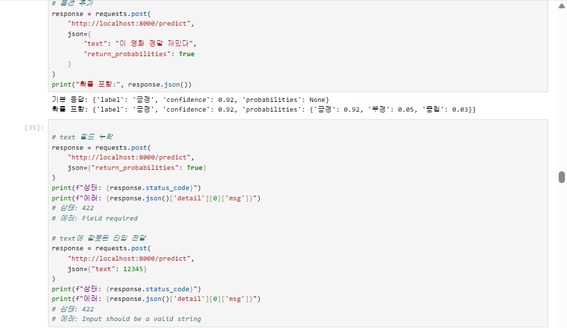  
  

- 섹션3 셀 출력

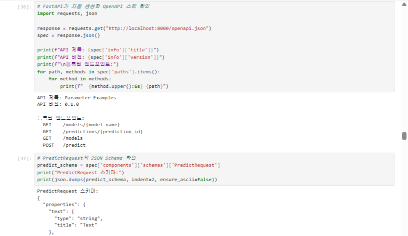  
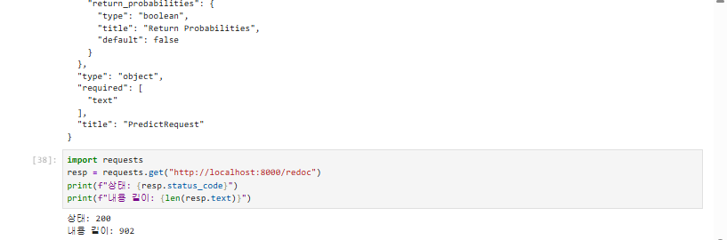  

- 섹션5 수행내역 캡처

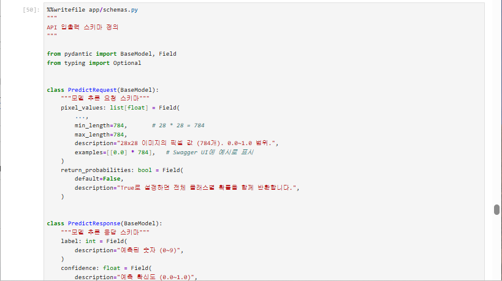  
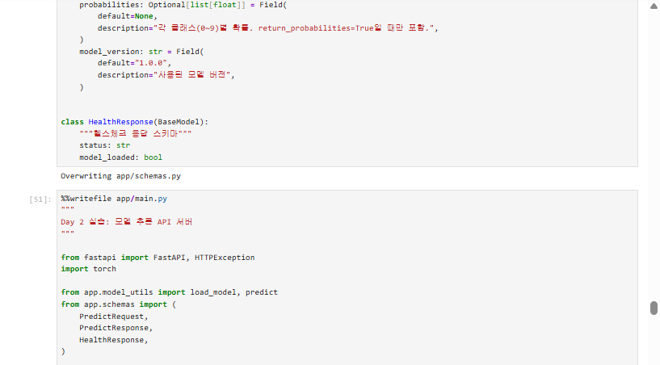  
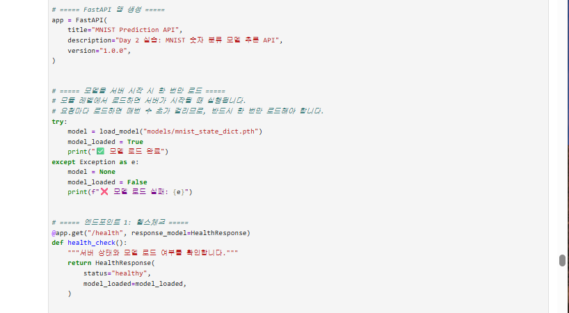  
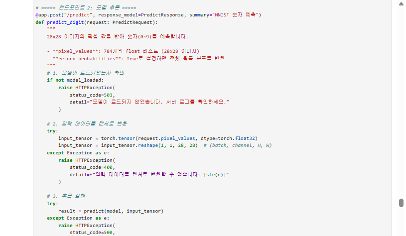  
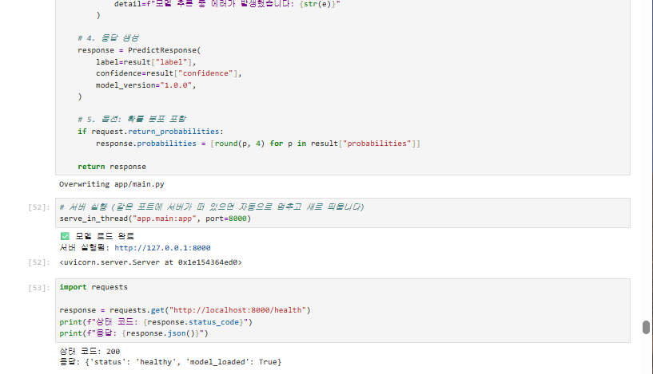  
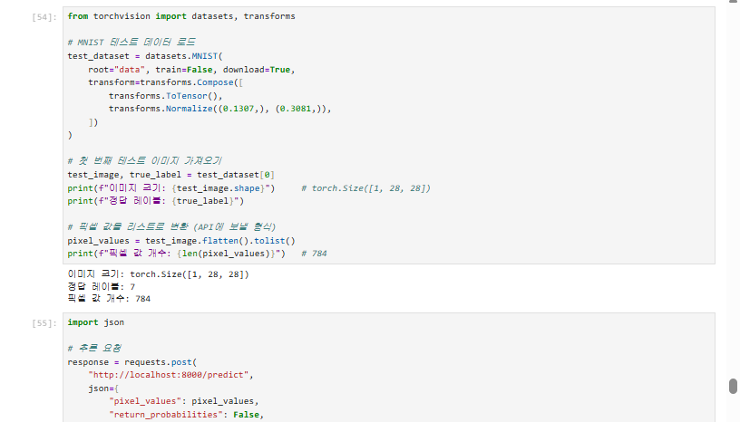  
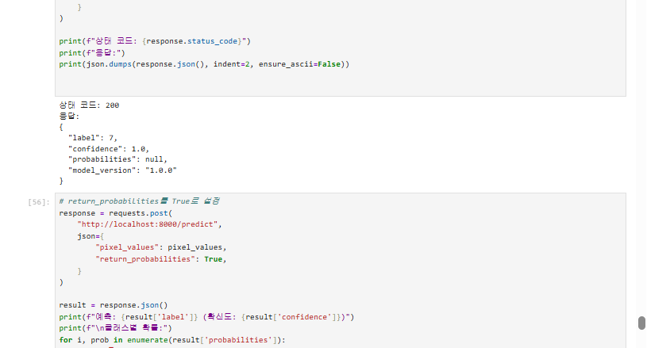  
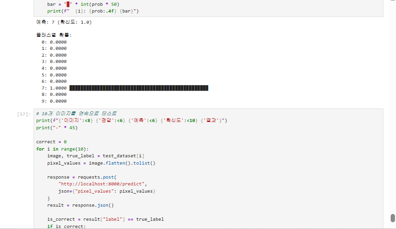  
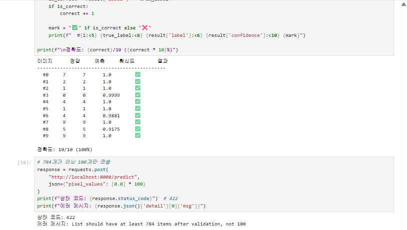  
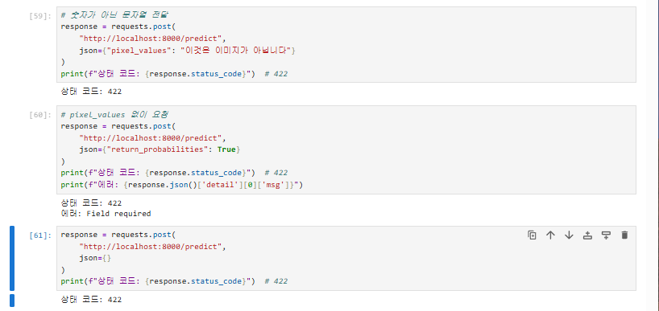  
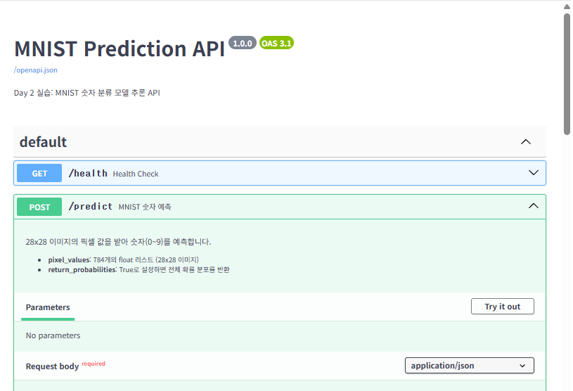  
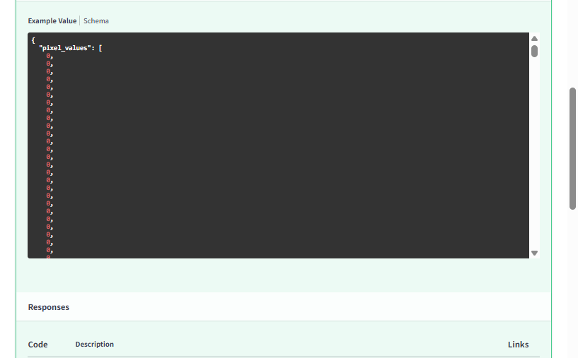  
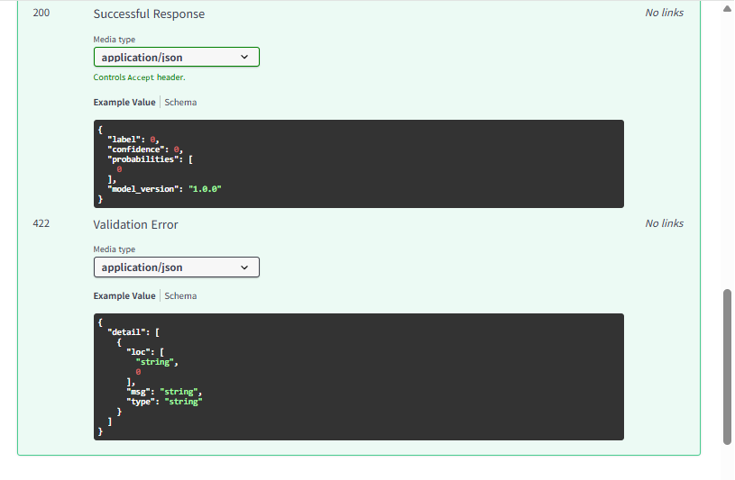  

ㅡㅡㅡㅡㅡㅡㅡㅡㅡㅡㅡㅡㅡㅡㅡㅡㅡㅡㅡㅡㅡㅡㅡㅡㅡㅡㅡㅡㅡㅡㅡㅡㅡㅡㅡㅡㅡㅡㅡㅡㅡㅡㅡㅡㅡㅡㅡㅡㅡㅡㅡㅡㅡㅡㅡㅡㅡㅡㅡㅡㅡ  

섹션1 체크포인트  

1. FastAPI가 Flask보다 모델 배포에 적합한 이유 세 가지는 무엇입니까?

FastAPI는 모델 배포에 필요한 기능을 기본적으로 잘 지원합니다.  

Pydantic을 이용한 자동 데이터 검증  
Swagger UI를 이용한 자동 API 문서 생성  
async/await 기반의 비동기 처리 지원  

따라서 입력 검증, API 문서화, 여러 요청 처리 등을 직접 구현해야 하는 부담이 줄어듭니다.  

2. Uvicorn의 역할은 무엇이며, 왜 FastAPI와 함께 사용합니까?

Uvicorn은 ASGI 웹 서버입니다.   

클라이언트의 HTTP 요청을 받아 FastAPI 애플리케이션에 전달하고, FastAPI가 만든 응답을 다시 클라이언트에게 전달합니다.  

FastAPI 자체는 직접 네트워크 요청을 받아 처리하는 웹 서버가 아니기 때문에 Uvicorn 같은 ASGI 서버가 필요합니다.  

3. @app.get("/health")에서 get과 "/health"는 각각 무엇을 의미합니까?

get은 HTTP GET 메서드를 의미합니다.  

"/health"는 요청을 받을 URL 경로(Path) 입니다.  

따라서 클라이언트가 GET /health 요청을 보내면 해당 함수가 실행됩니다.  

4. FastAPI에서 dict를 반환하면 어떤 일이 자동으로 일어납니까?

Python 딕셔너리를 반환하면 FastAPI가 이를 자동으로 JSON 형식으로 직렬화하여 HTTP 응답으로 반환합니다.  

따라서 json.dumps()를 직접 호출할 필요가 없습니다.  

ㅡㅡㅡㅡㅡㅡㅡㅡㅡㅡㅡㅡㅡㅡㅡㅡㅡㅡㅡㅡㅡㅡㅡㅡㅡㅡㅡㅡㅡㅡㅡㅡㅡㅡㅡㅡㅡㅡㅡㅡㅡㅡㅡㅡㅡㅡㅡㅡㅡㅡㅡㅡㅡㅡㅡㅡㅡㅡㅡㅡㅡ   

섹션2 체크포인트  

1. /models/sentiment-v1에서 sentiment-v1은 어떤 종류의 파라미터입니까?

sentiment-v1은 Path 파라미터입니다.  

특정 모델이라는 리소스를 식별하기 위해 URL 경로 자체에 값이 들어갑니다.  

2. /models?status=running&limit=5에서 status와 limit은 어떤 종류의 파라미터입니까?

둘 다 Query 파라미터입니다.  

URL 뒤에 ?key=value 형식으로 전달되며 검색, 필터링, 페이지네이션 등의 조건을 지정할 때 사용합니다.  

3. 모델 추론 요청에 Request Body를 사용하는 이유는 무엇입니까?

모델 추론 입력은 텍스트, 이미지 데이터, 옵션 등 복잡하고 많은 데이터를 전달해야 하는 경우가 많기 때문입니다.  

Request Body는 JSON 형태의 구조화된 데이터를 전달할 수 있고 URL 길이 제한의 영향을 받지 않으므로 모델 추론 요청에 적합합니다.  

4. FastAPI에서 함수의 파라미터가 Path, Query, Body 중 어디서 오는지 어떻게 판별합니까?

FastAPI는 함수 정의와 타입 선언을 보고 자동으로 판단합니다.  

ㅡㅡㅡㅡㅡㅡㅡㅡㅡㅡㅡㅡㅡㅡㅡㅡㅡㅡㅡㅡㅡㅡㅡㅡㅡㅡㅡㅡㅡㅡㅡㅡㅡㅡㅡㅡㅡㅡㅡㅡㅡㅡㅡㅡㅡㅡㅡㅡㅡㅡㅡㅡㅡㅡㅡㅡㅡㅡㅡㅡㅡ  

섹션3 체크포인트  

1. FastAPI에서 Swagger UI에 접속하려면 어떤 URL로 이동합니까?

기본 주소는:  

http://localhost:8000/docs  

입니다.  

2. Swagger UI가 코드와 항상 동기화될 수 있는 이유는 무엇입니까?

FastAPI가 코드의 엔드포인트, 타입 힌트, Pydantic 모델을 기반으로 OpenAPI 스키마를 자동 생성하고,   

Swagger UI가 그 스키마를 읽어 문서를 만들기 때문입니다.  

따라서 API 코드를 수정하면 문서도 자동으로 변경됩니다.  

3. Pydantic 모델의 Field(description=, examples=)는 Swagger UI의 어디에 반영됩니까?

Swagger UI의 Request Body 입력 스키마와 Schema 설명 영역에 반영됩니다.  

description은 각 필드의 설명으로 표시되고, examples는 요청 데이터 예시로 표시됩니다.  

4. Swagger UI와 ReDoc의 핵심 차이는 무엇입니까?

Swagger UI는 API 문서를 보면서 직접 요청을 실행하고 테스트할 수 있다는 장점이 있습니다.  

ReDoc은 문서를 읽고 탐색하기 좋게 표현하는 데 더 중점을 둡니다.  

ㅡㅡㅡㅡㅡㅡㅡㅡㅡㅡㅡㅡㅡㅡㅡㅡㅡㅡㅡㅡㅡㅡㅡㅡㅡㅡㅡㅡㅡㅡㅡㅡㅡㅡㅡㅡㅡㅡㅡㅡㅡㅡㅡㅡㅡㅡㅡㅡㅡㅡㅡㅡㅡㅡㅡㅡㅡㅡㅡㅡㅡ  

섹션4 체크포인트  

1. text: str과 text: str = "기본값"의 차이는 무엇입니까?

text: str 은 필수 필드입니다. 요청에서 값이 빠지면 검증 오류가 발생합니다.  

반면 text: str = "기본값" 은 선택적 필드이며, 값을 전달하지 않으면 "기본값"이 자동으로 사용됩니다.  

2. Field(..., min_length=1, max_length=5000)에서 ...은 무엇을 의미합니까?

...은 해당 필드가 필수 필드라는 의미입니다.  

따라서 요청에 해당 값이 반드시 포함되어야 합니다.  

3. 422 에러 응답에서 loc 필드는 어떤 정보를 담고 있습니까?

loc은 오류가 발생한 위치를 나타냅니다.  

예:  

"loc": ["body", "text"]  

라면 Request Body의 text 필드에서 문제가 발생했다는 의미입니다.  

4. response_model을 지정하면 어떤 이점이 있습니까?

response_model을 지정하면:  

Swagger UI에 응답 구조가 자동으로 문서화됩니다.  
반환 데이터가 지정한 타입과 구조에 맞는지 검증할 수 있습니다.  
스키마에 없는 필드는 응답에서 자동으로 제거할 수 있습니다.  
내부 데이터가 실수로 클라이언트에 노출되는 것을 방지할 수 있습니다.  

ㅡㅡㅡㅡㅡㅡㅡㅡㅡㅡㅡㅡㅡㅡㅡㅡㅡㅡㅡㅡㅡㅡㅡㅡㅡㅡㅡㅡㅡㅡㅡㅡㅡㅡㅡㅡㅡㅡㅡㅡㅡㅡㅡㅡㅡㅡㅡㅡㅡㅡㅡㅡㅡㅡㅡㅡㅡㅡㅡㅡㅡ  

섹션5 체크포인트  

1. 모델을 서버 시작 시 한 번만 로드해야 하는 이유는 무엇입니까?

모델을 매 요청마다 로드하면 모델 파일을 디스크에서 읽고 메모리에 올리는 작업이 반복되어 추론 속도가 매우 느려지고 서버 자원이 낭비됩니다.  

따라서 서버 시작 시 모델을 한 번만 로드하고 메모리에 유지한 뒤 여러 요청에서 재사용하는 것이 효율적입니다.  

2. pixel_values가 784개가 아닌 요청이 들어오면 어떤 일이 발생합니까? 이를 처리하는 코드를 직접 작성했습니까?

pixel_values는 MNIST의 28 × 28 = 784개 픽셀 값을 가져야 합니다.  

784개가 아닌 값이 들어오면 Pydantic의 길이 검증에 의해 요청이 거부되고 HTTP 422 Unprocessable Entity 응답이 반환됩니다.  

실습에서는 예를 들어 100개만 전송하여 확인했습니다.  

response = requests.post(   
    "http://localhost:8000/predict",  
    json={"pixel_values": [0.0] * 100}  
)  

이 경우 422 에러가 발생합니다.  

그리고 별도의 if len(pixel_values) != 784 같은 검증 코드를 직접 작성한 것이 아니라,   

Pydantic 스키마의 min_length, max_length 조건으로 자동 처리했습니다.  

3. HTTPException(status_code=503)은 어떤 상황에서 사용했습니까? 왜 500이 아니라 503입니까?

모델이 정상적으로 로드되지 않아 추론 서비스를 제공할 준비가 되지 않은 상황에서 503을 사용합니다.  

503 Service Unavailable은 서버 자체는 동작하고 있지만 현재 요청을 처리할 수 있는 서비스가 준비되지 않았다는 의미입니다.  

반면 500 Internal Server Error는 서버 내부에서 예상치 못한 오류가 발생했을 때 사용합니다.  

따라서:  

모델 로드 실패 / 모델 사용 불가능  
→ 503 Service Unavailable  

추론 과정에서 예상하지 못한 내부 오류  
→ 500 Internal Server Error  

로 구분합니다.  

4. Swagger UI에서 PredictRequest의 description과 examples가 어디에 표시됩니까?

PredictRequest의 Field()에 설정한:  

description=  
examples=  

정보는 Swagger UI의 POST /predict 요청 스키마와 Request Body 영역에 자동으로 표시됩니다.  

사용자가 Swagger UI에서 /predict를 펼치고 Try it out을 누르면 요청 필드에 대한 설명과 예시를 확인할 수 있습니다.  