# 과제 제출
- 로컬에 Qwen 3.8 Q4 K_M 모델이 설치되어 있어서 이 모델로 사용함

## 테스트 1 실행결과

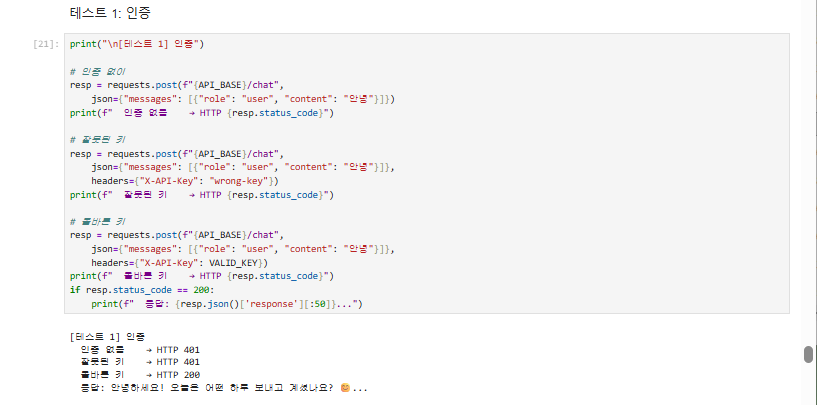  

## 테스트 2  실행결과  

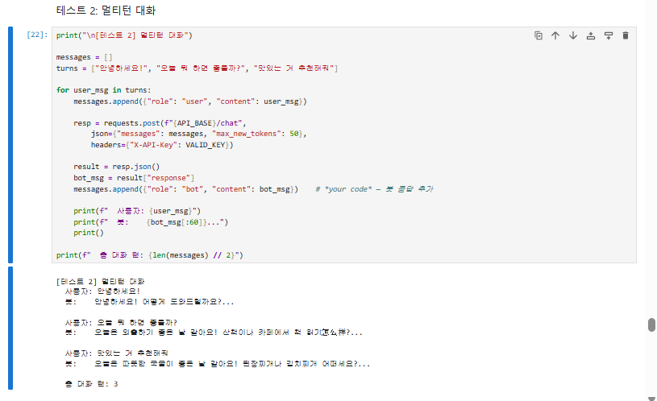  

## 테스트 3 실행결과  

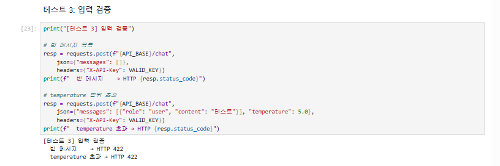  

## 테스트 4 실행결과  

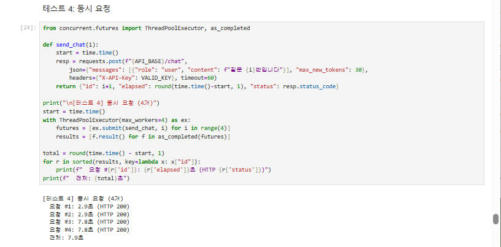  

## 테스트 A UI 캡처

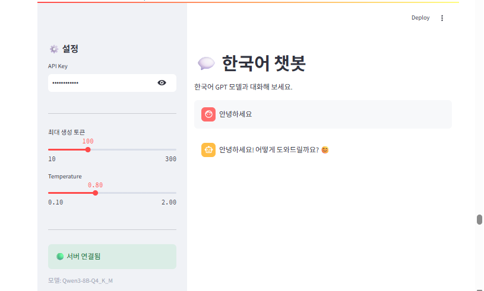  

## 테스트 B UI 캡처  

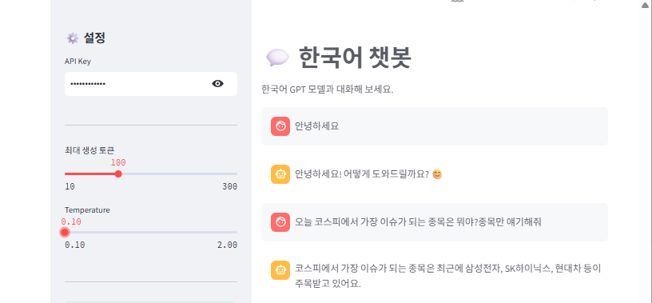  
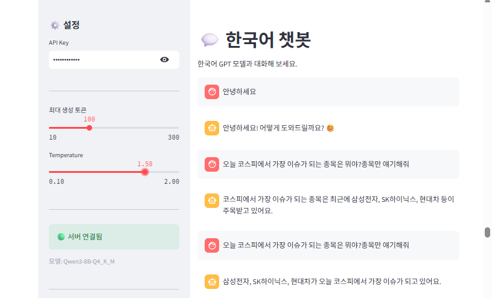  

## 테스트 C UI 캡처  

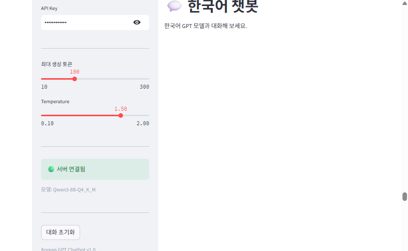  

## 테스트 D UI 캡처  

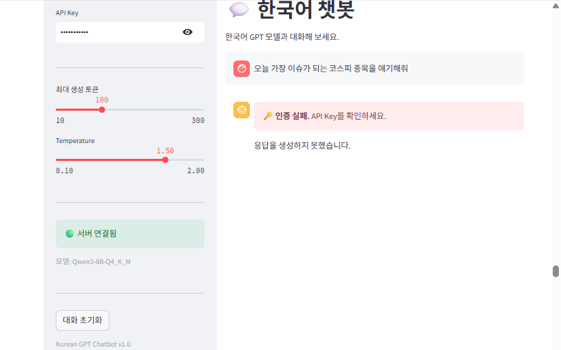  

## 각 체크포인트 답변  

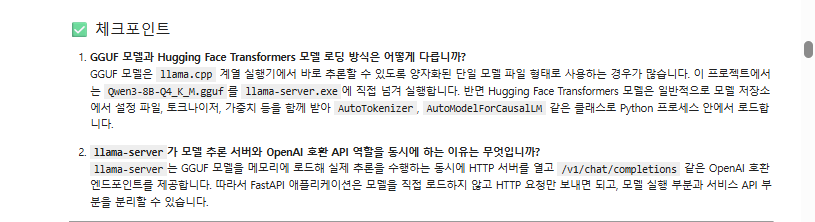  
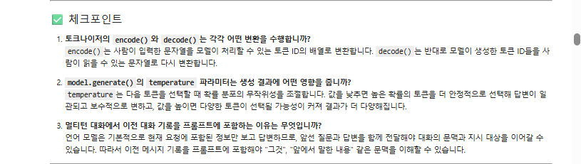  
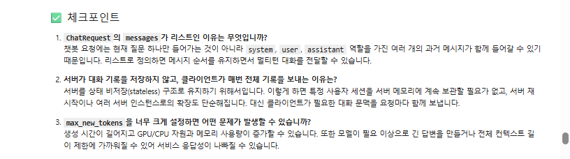  
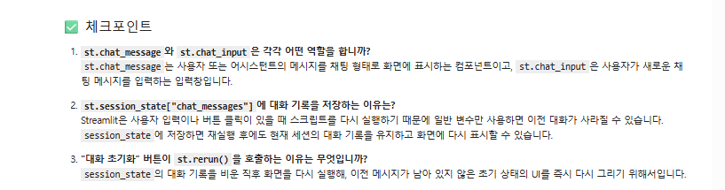  
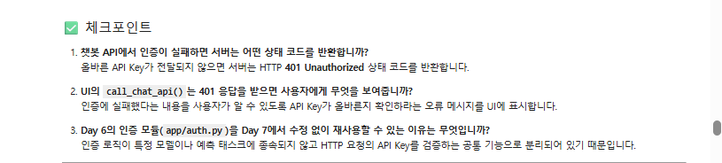  
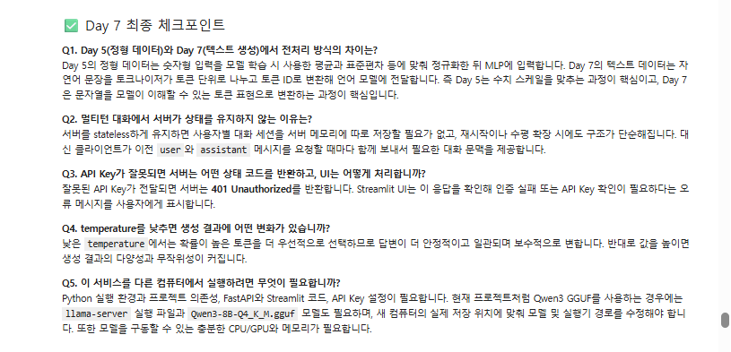  

# 회고  

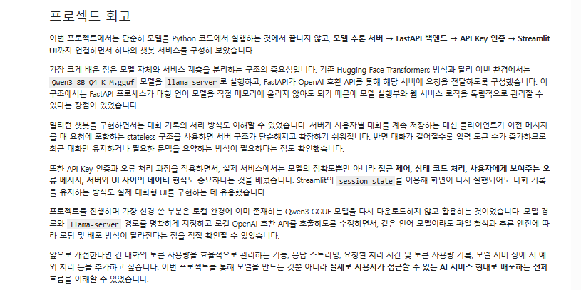  
